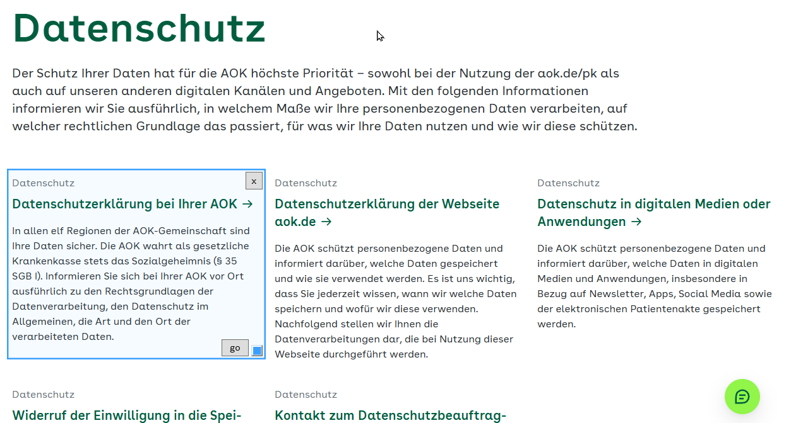
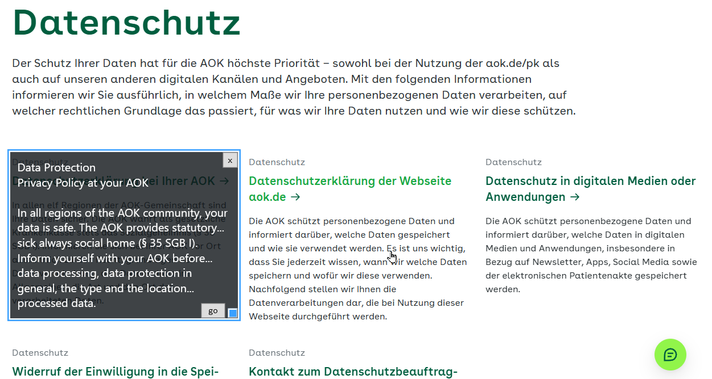

# Product Showcase

## Product Story

**User and problem:** Anyone facing a language barrier who runs a local LLM and
wants private, in-place translation of on-screen text — contracts, insurance
paperwork, scans, browser pages, messages — without uploading it to a cloud
translation service.

**Value demonstrated:** Point a floating, resizable overlay at foreign-language
text anywhere on screen; get a translation rendered in place, entirely
offline, with no copy-paste and no captured image ever written to disk.

**Why this scope:** The four milestones (runnable shell → core journey →
empty/error states → automated checks + walkthrough) cover the brief's full
"Must Demonstrate" list, plus an unplanned-but-required fifth milestone for
the settings window and pane-geometry persistence (see `DECISIONS.md`).
Multi-monitor support, layout-matched rendering, and a packaged `.exe` were
cut deliberately — each was flagged as adding real complexity without adding
to the core value being proven (see `PRODUCT_BRIEF.md` non-goals).

## Core Journey

Open (`Win+Alt+X`) → drag/resize (any edge/corner) over foreign text →
trigger (hotkey or a click on the pane) → busy indicator → translated text
renders in place, autofit → close (hotkey or `Escape`). A
forced-unreachable-endpoint test confirmed the error/retry branch: pane stays
open at the same position/size with a clear message and retry path.

## Evidence

### Product

- **Acceptance criteria checked:** All rows in `PRODUCT_BRIEF.md`'s Acceptance
  Evidence table were exercised live — tray icon menu, borderless
  transparent-center pane (drag/resize from any edge or corner, close by
  mouse), 3-state hotkey cycle, click-to-trigger, pane geometry persisted
  across restarts, in-memory capture,
  settings window (endpoint/model/language/timeout/hotkey), busy indicator,
  inline retryable error state, autofit rendering.
- **Feedback or observations:** The first live walkthrough attempt actually
  succeeded (the configured Ollama endpoint was reachable), so the error path
  wasn't exercised naturally — it had to be forced by deliberately pointing
  Settings at an unreachable address, then reverted. A full-desktop screenshot
  taken early in the session (to self-verify the GUI) incidentally captured
  unrelated content from other open windows; it was deleted immediately and
  the rest of the walkthrough was driven by the user directly instead (see
  "Most important lesson" below).
- **Edge cases reviewed:** no-legible-text case (explicit model sentinel, not
  a blank-string check — see `DECISIONS.md`), malformed/unexpected Ollama
  response JSON (now a clear retryable message, covered by tests), settings
  field validation (empty model/language, non-positive timeout, invalid
  hotkey key/URL).

### Technical

- **Install and run verification:** `dotnet restore`, `dotnet build`,
  `dotnet run` all executed and confirmed working in this session (app
  launched to the tray with no startup errors, twice, across two separate
  runs).
- **Tests, lint, type checks, or build commands completed:** `dotnet build
  BabelPane.sln` — 0 warnings, 0 errors. `dotnet test BabelPane.sln` — 14/14
  passed (`AppConfig` JSON round-trip incl. null geometry; Ollama response
  parsing incl. malformed-JSON and missing-field cases; multi-monitor
  geometry-recovery logic; translation-mode prompt wording). `dotnet format
  BabelPane.sln` — ran clean, fixed one spacing nit in the WPF-scaffolded
  `AssemblyInfo.cs`.
- **Not verified:** Hotkey registration, screen capture, and
  drag/resize are GUI/OS-interop paths not covered by automated tests —
  verified manually instead.

## Working with Claude Code

**Where it accelerated the work:** Scaffolding the xUnit test project and
identifying the one refactor needed to make Ollama's response parsing
testable without mocking `HttpClient`; running a structured 7-lens critical
review that caught a real issue (a real home-LAN IP address hardcoded as the
shipped default setting) that a normal read-through could easily miss.

**Where my review changed or rejected its proposal:** Rejected the proposed
approach of Claude taking full-desktop screenshots to self-verify the GUI
walkthrough, after one such screenshot exposed unrelated window content —
switched to driving the app directly instead. Also chose to log one review
finding (a small synchronous UI-thread pause during capture) as a known
limitation rather than have it fixed, since it's immaterial in practice.

**Most important lesson about directing it:** A model narrating "this should
work" from reading the code is not the same as a human exercising the
journey — the live walkthrough's happy path succeeded on the first try, which
would have left the error/retry path unverified if not deliberately forced.
Automated GUI verification (screenshots, simulated input) also carries a real
privacy cost on a real desktop that a sandboxed test environment wouldn't
have — worth deciding deliberately, not defaulting into.

## Known Limitations

- Multi-monitor supported; only verified with monitors at the same DPI
  scaling — mixed-DPI setups unverified.
- Source language auto-detected; only the target language is configurable.
- Autofit + wrap rendering, not layout-matched to the source.
- No translation history, logging, or side-by-side view.
- ~120ms synchronous UI-thread pause during every capture (see `DECISIONS.md`).
- No validation of translation quality/accuracy — entirely dependent on the
  configured local model. Literal mode's prompt is tuned to one model's
  specific failure modes and may need retuning for a different model.
- Captured regions are upscaled 2x before OCR (see the post-demo bug-hunt
  section below); a very small pane over dense text may still benefit from
  being resized larger before triggering.
- `TimeoutSeconds` defaults to 120s; Literal mode's longer prompt roughly
  doubled measured response time versus the old shorter default prompt.

## Post-Deliverable Addition: Multi-Monitor Support

After the showcase above was packaged, the user picked up multi-monitor
support (previously an explicit non-goal) as the first item from their
backlog. `ApplicationHighDpiMode=PerMonitorV2` plus a new pure
`ScreenGeometry.EnsureVisible` helper (unit-tested) now let the pane work on
any connected monitor, with a fallback to a centered position if saved
geometry falls outside every currently connected monitor. Verified live:
dragging the pane onto a real secondary monitor and translating there
captured the correct content; geometry saved there reopened correctly after a
relaunch; a deliberately off-screen saved position recovered to a centered,
reachable spot. See `DECISIONS.md` for the full record, including the one
caveat carried forward — mixed-DPI-per-monitor setups remain unverified on
available hardware.

## Post-Deliverable Addition: Click-to-Trigger, Native Resize, Copy to Clipboard

Three more backlog items picked up after multi-monitor support: the `[go]`
button was removed in favor of clicking anywhere in the pane (a click, not a
drag, triggers capture+translate — detected by comparing window position
before/after the blocking `DragMove()` call); the single visible resize grip
was replaced by `System.Windows.Shell.WindowChrome`, giving native edge/corner
resize with OS cursors and no visible grip at all; and a `[Copy]` button
appears once a translation renders, copying the text to the clipboard,
closing the pane immediately, then showing a brief "Copied" confirmation in a
separate small window positioned where the pane was (an in-pane flash was
tried first but was too hard to read before the pane closed — moved to
after closing instead, per user feedback). All verified live. See
`DECISIONS.md` for the full record, including one still-open item: the two
`assets/*.png` screenshots predate this and the multi-monitor work and are
stale, pending a retake.

## Post-Deliverable Addition: Literal vs. Summary Translation Mode

The user noticed the model was producing an interpreted summary rather than
a faithful translation, despite the existing prompt already asking it to
"translate all the text" — a real gap between instruction and observed model
behavior. Added a settings toggle (`Literal translation`, the new default, or
`Summary interpretation`, today's original behavior, unchanged) backing two
different prompts plus `temperature=0` for Literal mode only. Getting the
Literal prompt right took two live-tested iterations: the first version
("literally," "sentence by sentence") produced stilted, grammatically broken
English that mirrored the source German's word order; rewritten to
explicitly require natural, fluent target-language phrasing while still
translating every sentence completely (nothing summarized or omitted). A
second issue then surfaced — the model bracketing hedged word choices, e.g.
`[held]`, in otherwise-correct output — fixed with an explicit "no bracketed
alternates, no hedging" instruction, added to both modes' prompts since it's
an output-cleanliness concern rather than a literal-vs-summary one. Confirmed
clean on retest. See `DECISIONS.md` for the full iteration record.

## Post-Deliverable Bug Hunt: Demo-Day Regressions

Right after a colleague demo, the user reported translations coming back as
an empty pane with no text and no Copy button — a real regression, not a
one-off. Root cause: `RunTriggerAsync`'s cancellation handling assumed
`OperationCanceledException` could only mean "the user pressed the hotkey to
cancel," but `HttpClient`'s own request timeout throws the identical
exception type — a genuine timeout was being silently swallowed as if it
were an already-handled user action, leaving the pane stuck with no
feedback at all. Fixed by checking *which* token was actually cancelled.

Fixing that surfaced a real timeout underneath: timing the user's actual
Ollama server directly showed a trivial text prompt taking 28s, and the new
Literal-mode prompt taking roughly 2x as long as the old default prompt on
comparable text (~14s vs. ~7s) — pushing real image-based requests close to
the 60s default. Raised the default to 120s.

A third issue then surfaced once translations were completing: real
captures at the user's actual (small) pane size kept coming back cut off
mid-sentence, confirmed as genuine data loss (not a display bug) by
comparing the on-screen text to the clipboard-copied text — identical, both
incomplete. Diagnosed with a controlled experiment against the live
server: the exact same source text rendered into a large image translated
completely every time; the same content rendered at the user's actual small
pane size came back garbled and incomplete, with Ollama's own
`done_reason: "stop"` showing the *model itself* decided it was done reading
an image that was too small/dense for it — not a token-limit cutoff.
Summary mode's forgiving paraphrasing had likely been masking this same
limitation all along. Fixed by upscaling every capture 2x before sending it
for OCR, confirmed against the user's own previously-failing case.

None of this was guessed at — every fix was driven by directly reproducing
the failure against the real Ollama server first. See `DECISIONS.md` for
the full record of each bug, its root cause, and its verification.

## Bridge to the Capstone

**Worth carrying forward:** The offline-first, in-place translation journey
itself — the core privacy value proposition (nothing leaves the machine)
doesn't require any of the cut scope to be compelling.

**Research or validation still required:** Real-world OCR+translate quality on
dense, legally consequential text (contracts, insurance) at production scale,
not just the synthetic/casual content tested here; whether autofit reads as
usable rather than cramped on genuinely long documents.

**Data, architecture, testing, accessibility, security, or governance work
needed:** Validation on a real mixed-DPI multi-monitor setup; a
packaging/distribution pipeline; an accessibility audit beyond the one
keyboard affordance added this session (`Escape` to close); automated
UI/interop testing if this moves past prototype stage.

**Recommended next product experiment:** A short usability test with one real
person translating a real (but non-sensitive) foreign-language document
end-to-end, to learn whether autofit rendering and the 3-state hotkey model
hold up outside a scripted walkthrough.
